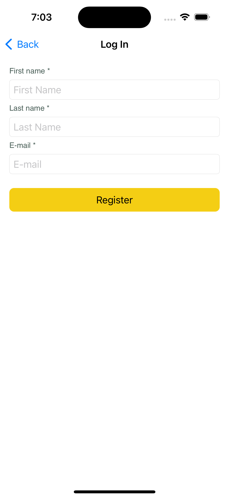
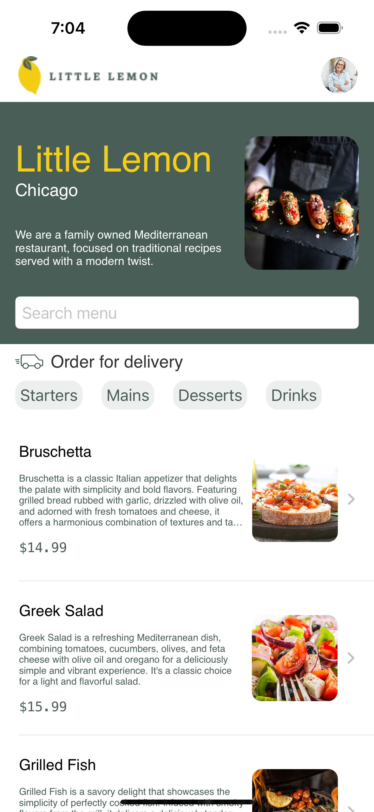
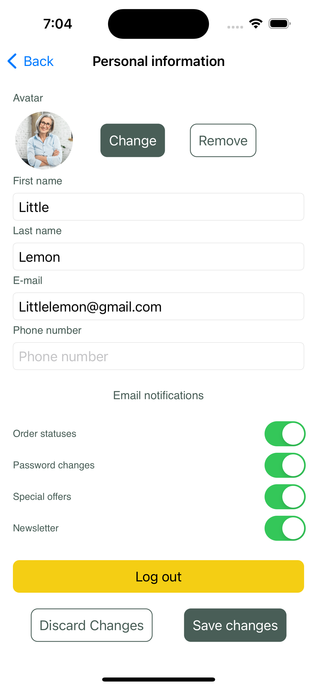
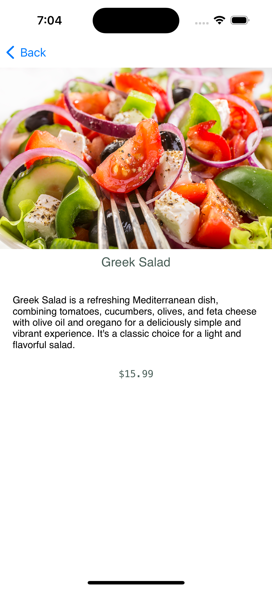

# Little Lemon Food Ordering App

The graded assessment will task you with creating a food-ordering app for the Little Lemon restaurant. It will display the list of items that are available to order, and users can customize it by enabling filters to show only specified categories of items, or by using the search feature to locate items by name. The images below demonstrate how the completed app would appear: 

   
   
   

   
   

